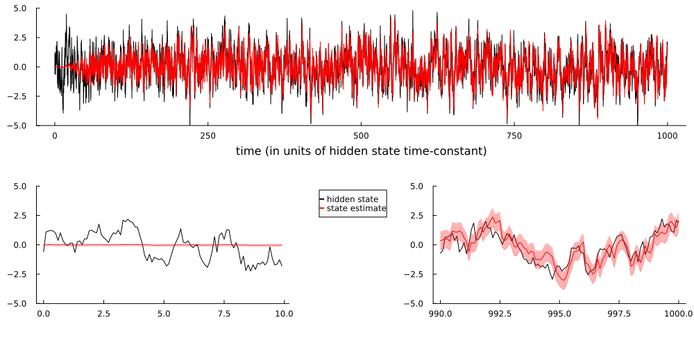
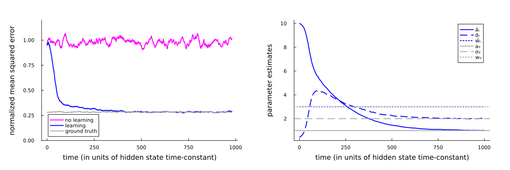
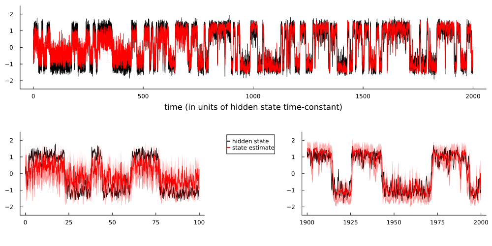
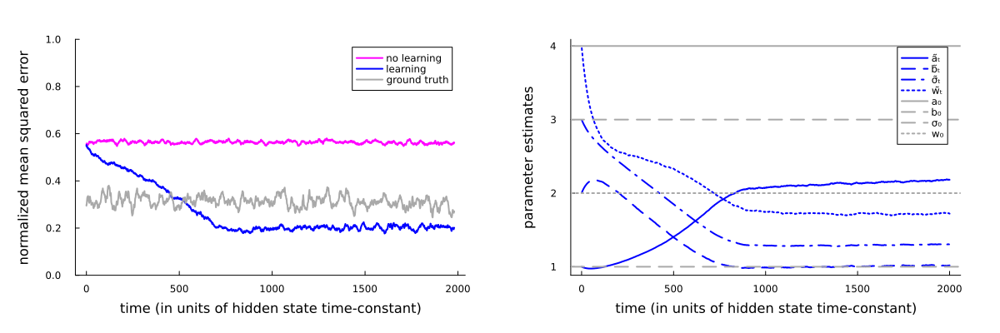

# Online Maximum Likelihood Estimation of the Parameters of Partially Observed Diffusion Processes

This is the code to reproduce the figures from [this paper](https://ieeexplore.ieee.org/document/8528340).
To run the code, you need to install Julia and run the following scripts.

## make_fig1.jl
Running this script will produce figure 1:

## make_fig2.jl
Running this script will produce figure 2:

## make_fig3.jl
> [!NOTE]  
> The code for reproducing this figure is broken and currently not included in this repo.

## make_fig4.jl
Running this script will produce figure 4:

## make_fig5.jl
Running this script will produce figure 5:

